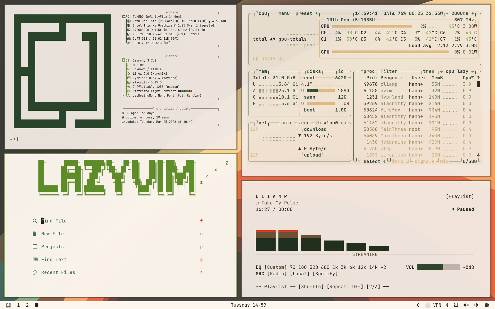
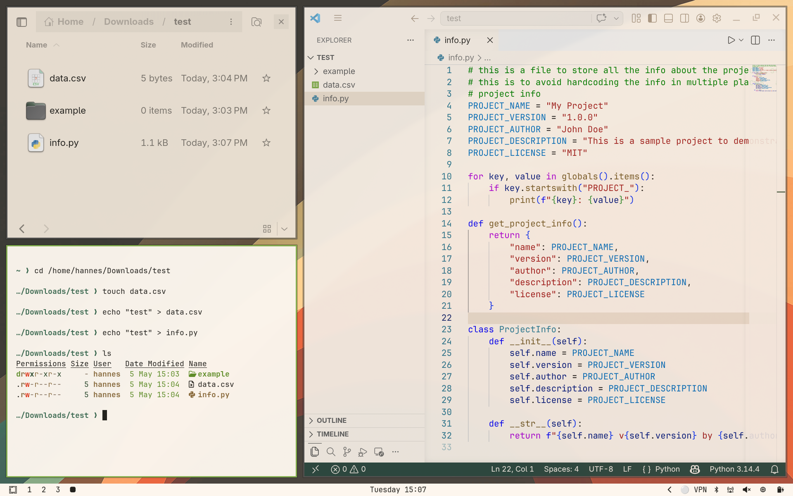
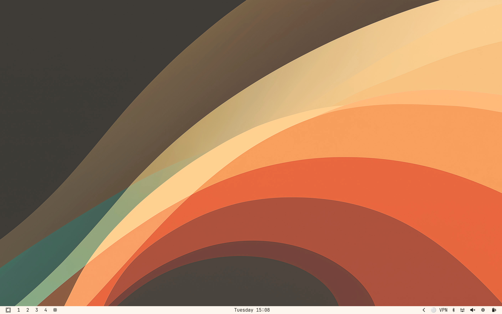
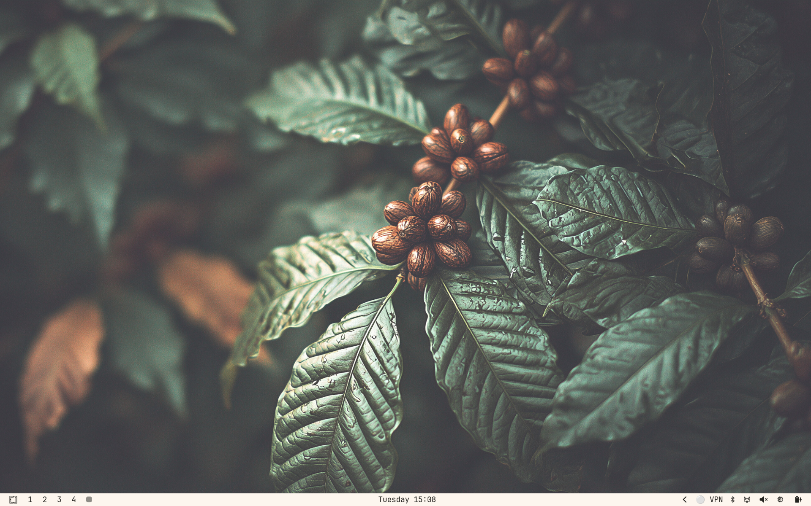

# Ristretto Light - Omarchy Theme

A warm, high-contrast light theme for Omarchy, inspired by coffee tones and olive accents.

## Install

1. Copy this repository URL.
2. Press `SUPER + ALT + SPACE`.
3. Open `Install` -> `Style` -> `Theme`.
4. Paste the link and submit.

### CLI install

```bash
omarchy-theme-install https://github.com/<your-username>/omarchy-ristretto-light-theme
```

## Preview setup

Use the same structure as Archwave:

1. Create a `preview/` folder.
2. Add screenshots named `preview-0.png`, `preview-1.png`, `preview-2.png`, `preview-3.png`.
3. Keep paths exactly as `preview/preview-<n>.png`.
4. Add them to README with:

```md




```

Tip: capture 3-4 screens (desktop, terminal, launcher, lock screen) so the theme is easy to evaluate.
